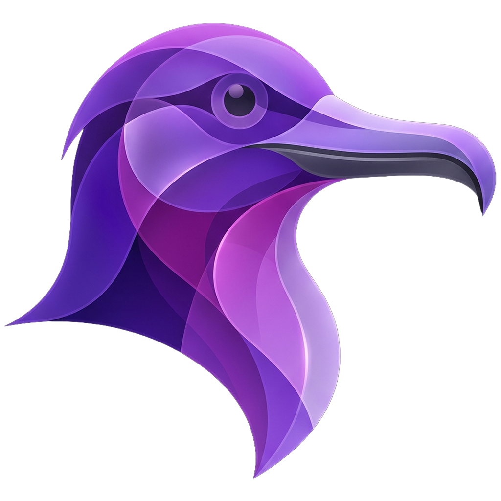

# Fregata Press Kit

Assets and reference material for journalists, bloggers, and reviewers covering Fregata.

If you need higher-resolution assets, lifestyle shots, or want to coordinate on an embargo, get in touch.

---

## Boilerplate

> Fregata is a private, local-first network video recorder for macOS, built on the open-source [Frigate NVR](https://frigate.video) engine. Object detection runs on the Apple Neural Engine, video decode and encode go through VideoToolbox, and the whole thing ships as a single signed `.app` - drag to Applications, done. No Docker, no VMs, no terminal, no cloud.

## One-liners

- **Tagline:** Your cameras. Your Mac. No cloud.
- **Short description:** Native NVR for Apple Silicon.
- **Long description:** A private, local-first network video recorder for macOS. Object detection on the Apple Neural Engine. Hardware-accelerated decode and encode through VideoToolbox. One signed app, no terminal setup, no cloud account.

## Quick facts

| | |
|---|---|
| **Name** | Fregata |
| **What it is** | Native macOS NVR (network video recorder) |
| **Built on** | [Frigate NVR](https://frigate.video) (open source) |
| **Platform** | macOS 13 (Ventura) or later |
| **Architecture** | Apple Silicon (M1 or newer) |
| **Distribution** | Signed, notarized `.app` bundle |
| **Detection** | Apple Neural Engine (CoreML) |
| **Video** | VideoToolbox H.264 / H.265 decode and encode |
| **Privacy** | Local-first; no Fregata account required |
| **Website** | https://fregata.app |
| **Documentation** | https://docs.fregata.app |
| **Community** | https://github.com/3rdBitLabs/Fregata/discussions |

---

## Logo



| File | Size | Use |
|---|---|---|
| [`fregata-icon-1024.png`](fregata-icon-1024.png) | 1024 x 1024, PNG with alpha | Primary app icon. Scale down as needed. |
| [`fregata-og-1200x630.png`](fregata-og-1200x630.png) | 1200 x 630, PNG | Social card image; suitable for article hero or thumbnail. |

### Logo dos and don'ts

**Do:**
- Use the icon at any size from 16 px to 1024 px. It's designed to read clearly at all sizes.
- Preserve transparent padding around the icon. Don't crop in tight.
- Place on dark or neutral backgrounds for best contrast.

**Don't:**
- Recolor, distort, rotate, or add effects (glow, drop shadow, outline, gradient overlay).
- Combine the icon with other logos in a way that implies a partnership we haven't announced.
- Use the icon as the primary mark for your own product, dashboard, or service.

---

## Brand colors

Fregata's accent palette is a deep violet on near-black. The app itself respects macOS appearance, so dark mode is the canonical brand surface.

| Role | Hex | Notes |
|---|---|---|
| Background | `#0B0A12` | Near-black, slight violet tint |
| Background, elevated | `#100E1A` | Cards, panels |
| Background, secondary | `#15121F` | Subtle layering |
| Accent (primary) | `#A875FF` | Lavender-violet. CTAs, highlights. |
| Accent (deep) | `#6B3FE0` | Body of gradient buttons, focus states |
| Accent (highlight) | `#D070FF` | Magenta accent, used sparingly |
| Foreground | `#ECE8F7` | Primary text on dark |
| Foreground, dim | `#847C9E` | Secondary text, captions |

## Typography

Fregata uses the **system font stack** everywhere. No custom web fonts.

```css
font-family: -apple-system, BlinkMacSystemFont, "SF Pro Text", "Segoe UI",
             system-ui, sans-serif;
```

On macOS this resolves to **SF Pro**. There is no custom Fregata typeface.

---

## Voice and messaging

A few notes on how we talk about Fregata, in case you want to mirror the framing:

- **"Native"** is load-bearing. Fregata is not a wrapper, container, or VM. It runs as a normal macOS process.
- **"Local-first"**, not "offline-only". Fregata works without an internet connection, but it doesn't refuse to use one (e.g. for software updates).
- **"Built on Frigate"** is important attribution. Fregata is a port and packaging effort, not a from-scratch reimplementation. Always credit Frigate when describing the detection pipeline.
- **Avoid "AI-powered camera"** - Fregata uses object detection, the same kind that's been in NVRs for years. The interesting story is on-device inference on the Apple Neural Engine, not "AI" generally.

## Attribution to Frigate

Fregata is a native macOS port of [Frigate NVR](https://github.com/blakeblackshear/frigate) by [Blake Blackshear](https://github.com/blakeblackshear) and contributors. When covering Fregata, please mention Frigate.

The Frigate name and logo are trademarks of Frigate, Inc. and are governed by the [Frigate Trademark Policy](https://github.com/blakeblackshear/frigate/blob/dev/TRADEMARK.md). The Frigate logo is **not** included in this press kit. If you need it, request it from Frigate, Inc.

---

## Contact

- **Security issues:** see [SECURITY.md](../SECURITY.md)
- **General community:** [GitHub Discussions](https://github.com/3rdBitLabs/Fregata/discussions)

## License for press use

The assets in this directory may be used in editorial coverage of Fregata: news articles, blog posts, reviews, videos, podcast cover art, conference slides. You may resize and crop as needed for layout.

You may **not** use these assets to:

- Imply endorsement, partnership, or affiliation that hasn't been announced.
- Brand your own product, service, app, or dashboard.
- Register domain names containing "Fregata".
- Sell merchandise featuring the Fregata name or icon.
